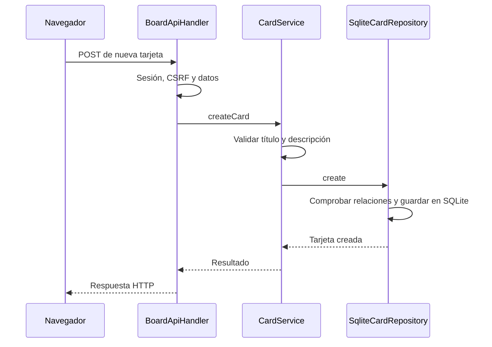

# Mapa del código de AulaFlow

Los enlaces llevan a archivos reales. Empieza por una operación concreta para ver sus responsabilidades.

## Capas y puntos de entrada

| Parte | Responsabilidad | Archivo para empezar |
| --- | --- | --- |
| Arranque | Conectar objetos, preparar persistencia y registrar rutas | [AulaFlowApplication](../../src/main/java/es/aulaflow/AulaFlowApplication.java) |
| Dominio | Representar conceptos y proteger sus valores válidos | [Card](../../src/main/java/es/aulaflow/domain/board/Card.java), [CardTitle](../../src/main/java/es/aulaflow/domain/board/CardTitle.java) |
| Aplicación | Coordinar operaciones mediante contratos de repositorio | [CardService](../../src/main/java/es/aulaflow/application/board/CardService.java), [CardRepository](../../src/main/java/es/aulaflow/application/board/CardRepository.java) |
| Presentación | Interpretar HTTP y producir HTML o JSON | [BoardHtmlHandler](../../src/main/java/es/aulaflow/presentation/board/BoardHtmlHandler.java), [BoardApiHandler](../../src/main/java/es/aulaflow/presentation/board/BoardApiHandler.java) |
| Infraestructura | Implementar almacenamiento y servidor | [SqliteCardRepository](../../src/main/java/es/aulaflow/infrastructure/persistence/sqlite/SqliteCardRepository.java), [AulaFlowHttpServer](../../src/main/java/es/aulaflow/infrastructure/http/AulaFlowHttpServer.java) |
| Configuración | Leer las opciones externas | [ApplicationConfig](../../src/main/java/es/aulaflow/shared/config/ApplicationConfig.java) |
| Mantenimiento | Ejecutar backup y restore | [AulaFlowMaintenance](../../src/main/java/es/aulaflow/operations/AulaFlowMaintenance.java) |

El dominio no depende de HTTP ni SQLite. Los servicios hablan con contratos de repositorio; la infraestructura los implementa. La clase de arranque elige las implementaciones y se las proporciona.

## Crear una tarjeta mediante la API

La ruta es `POST /api/v1/boards/{boardId}/columns/{columnId}/cards`. El identificador de la persona autenticada procede de la sesión; el repositorio lo utiliza para limitar el acceso a los datos del propietario. La vía de formularios HTML usa `BoardHtmlHandler` y comparte los servicios.

## Pantallas y navegador

| Archivo | Qué estudiar |
| --- | --- |
| [index.html](../../src/main/resources/web/index.html) | Portada y acceso al login |
| [login.html](../../src/main/resources/web/login.html) | Formulario de autenticación |
| [BoardPages.java](../../src/main/java/es/aulaflow/presentation/board/BoardPages.java) | HTML generado para tableros y tarjetas |
| [app.js](../../src/main/resources/web/assets/js/app.js) | Interacción, movimiento e idioma |
| [app.css](../../src/main/resources/web/assets/css/app.css) | Presentación y adaptación a pantallas |
| [ca.json](../../src/main/resources/web/assets/i18n/ca.json), [es.json](../../src/main/resources/web/assets/i18n/es.json) | Catálogos con las mismas claves |

Parte del HTML se genera en Java porque incluye datos de la persona autenticada. No todas las pantallas tienen un archivo `.html` independiente.

## Autenticación y persistencia

| Pregunta | Archivo |
| --- | --- |
| ¿Cómo se crea el primer administrador? | [ProvisionInitialAdministrator](../../src/main/java/es/aulaflow/application/auth/ProvisionInitialAdministrator.java) |
| ¿Cómo se comprueban credenciales y sesiones? | [AuthenticationService](../../src/main/java/es/aulaflow/application/auth/AuthenticationService.java) |
| ¿Cómo se protege una operación frente a CSRF? | [CsrfProtection](../../src/main/java/es/aulaflow/presentation/auth/CsrfProtection.java) |
| ¿Cómo se deriva el verificador de contraseña? | [Pbkdf2PasswordHasher](../../src/main/java/es/aulaflow/infrastructure/security/Pbkdf2PasswordHasher.java) |
| ¿Dónde se conservan las sesiones? | [InMemorySessionStore](../../src/main/java/es/aulaflow/infrastructure/auth/InMemorySessionStore.java) |
| ¿Cómo se abre SQLite? | [SqliteConnectionFactory](../../src/main/java/es/aulaflow/infrastructure/persistence/sqlite/SqliteConnectionFactory.java) |
| ¿Cómo se actualiza el esquema? | [SqliteMigrator](../../src/main/java/es/aulaflow/infrastructure/persistence/sqlite/SqliteMigrator.java), [migraciones SQL](../../src/main/resources/db/migration/) |

Para CSV, empieza por [CsvImportService](../../src/main/java/es/aulaflow/application/csv/CsvImportService.java) y el [contrato de intercambio](../contracts/csv/aulaflow-kanban-csv-v1.md). La importación separa validación y previsualización de la confirmación que modifica SQLite.

## Pruebas para leer junto al código

| Tipo | Ejemplo | Qué demuestra |
| --- | --- | --- |
| Dominio | [CardModelTest](../../src/test/java/es/aulaflow/domain/board/CardModelTest.java) | Reglas de valores de una tarjeta |
| Servicio | [CardServiceTest](../../src/test/java/es/aulaflow/application/board/CardServiceTest.java) | Coordinación con el repositorio |
| SQLite | [SqliteCardRepositoryTest](../../src/test/java/es/aulaflow/infrastructure/persistence/sqlite/SqliteCardRepositoryTest.java) | Almacenamiento, relaciones y orden |
| HTTP | [BoardEndpointTest](../../src/test/java/es/aulaflow/infrastructure/http/BoardEndpointTest.java) | Peticiones, estados, sesión y autorización |
| Recorrido completo | [VerticalSliceEndToEndTest](../../src/test/java/es/aulaflow/infrastructure/http/VerticalSliceEndToEndTest.java) | Operaciones relacionadas de principio a fin |
| Recuperación | [RestartRecoveryIntegrationTest](../../src/test/java/es/aulaflow/infrastructure/persistence/sqlite/RestartRecoveryIntegrationTest.java) | Datos conservados tras reiniciar |

En IntelliJ coloca un punto de interrupción en `CardService.createCard`, crea una tarjeta y observa los parámetros. Sigue al repositorio. No muestres cookies, contraseñas ni tokens al compartir la depuración.
